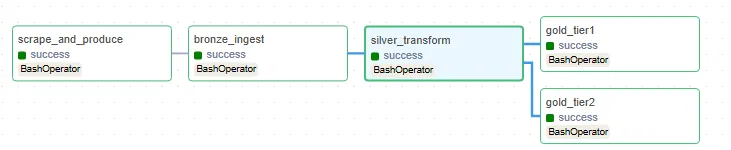

# 🇻🇳 Vietnam Tech Skill Gap Analytics Pipeline

> End-to-end data engineering pipeline that scrapes Vietnamese tech job postings from ITviec, streams them through Kafka + Spark Structured Streaming, transforms them through a Medallion architecture (Bronze/Silver/Gold) on MinIO, and surfaces skill-demand insights via a DuckDB-powered Streamlit dashboard — all orchestrated end-to-end by Airflow.



## Why this project

Most portfolio "data pipeline" projects use mock/synthetic data. This one scrapes **real, live job postings** from Vietnam's largest IT job board (ITviec), handles real-world messiness (bot detection, inconsistent salary formats, duplicate records), and produces genuine market insights — e.g. *Python and Data Engineer skills appear in 0% of Junior postings but 51%/39% of Senior postings*, revealing how skill requirements stratify by seniority.

## Architecture

```
ITviec (curl_cffi, bypasses bot detection)
        │  parses schema.org JobPosting JSON-LD
        ▼
Kafka (topic: raw.jobs)
        │
        ▼
Spark Structured Streaming
        │
        ▼
MinIO (S3-compatible, Medallion architecture)
  bronze/
  ├── raw_json/         ← raw Kafka messages, replayable
  └── parsed_parquet/   ← schema-parsed, partitioned by crawled_date
  silver/
  └── jobs_clean/       ← deduped, skills normalized to array,
                           salary parsed to (min, max, currency)
  gold/
  ├── top_skills/            ← Tier 1: demand ranking
  ├── salary_by_skill/       ← Tier 1: avg salary per skill
  ├── skill_cooccurrence/    ← Tier 2: which skills pair together
  └── skill_gap_by_level/    ← Tier 2: Junior vs Senior requirement gap
        │
        ▼
DuckDB (queries Parquet directly from MinIO via S3 protocol — no data copy)
        │
        ▼
Streamlit Dashboard

Airflow orchestrates the entire chain as one DAG:
  scrape_and_produce → bronze_ingest → silver_transform → [gold_tier1, gold_tier2]
```

## Stack

| Layer | Technology |
|---|---|
| Scraping | Python + `curl_cffi` (browser TLS impersonation to bypass bot detection) + BeautifulSoup |
| Ingestion | Kafka 7.6 |
| Processing | Apache Spark 3.5 (Structured Streaming for Bronze, batch for Silver/Gold) |
| Storage | MinIO (S3-compatible), Medallion architecture |
| Orchestration | Apache Airflow 2.8 (custom image w/ Docker-in-Docker to control Spark containers) |
| Serving | DuckDB (S3/httpfs extension) + Streamlit + Plotly |

## Key engineering decisions & problems solved

This section exists because most of the real work in a data pipeline is debugging integration issues, not writing the happy-path code.

- **Bot detection**: ITviec blocks plain `requests`. Solved with `curl_cffi` browser impersonation (`impersonate="chrome124"`), same technique used in a prior scraping project.
- **Reliable extraction without fragile CSS selectors**: discovered ITviec embeds full `schema.org/JobPosting` JSON-LD on every detail page — parsed structured JSON instead of scraping HTML, far more resilient to site redesigns.
- **Deprecated Docker images**: `bitnami/spark` images were pulled from Docker Hub mid-project → migrated to official `apache/spark:3.5.1-python3`.
- **S3A/MinIO hang (15–20 min)**: caused by `fs.s3a.endpoint` containing an `http://` scheme combined with `ssl.enabled=false` — a known hadoop-aws SSL-handshake bug. Fixed by using bare `host:port` for the endpoint.
- **Docker DNS flakiness**: long-running containers occasionally lost internal DNS resolution between services; resolved via full stack restart, made idempotent since Kafka has no persistent volume (data is re-published from `data/raw_jobs.json`).
- **Salary normalization bugs**: one listing quoted an *annual* salary while the rest of the market quotes *monthly* — silently produced a 10x outlier until detected and normalized. A second bug produced "crossed ranges" (avg_min > avg_max) when min/max were averaged from different job postings under a sparse sample — filtered out post-hoc.
- **Airflow orchestrating Spark in sibling containers**: rather than running Spark inside Airflow, mounted the host's Docker socket into the scheduler container (`docker.sock`) so Airflow can `docker exec` into the `spark-master` container — a standard local-dev pattern for orchestrating Docker Compose services from Airflow without full Kubernetes.
- **Streaming jobs don't terminate**: Spark Structured Streaming runs forever by default, which doesn't fit Airflow's task model. Added a `RUN_ONCE` mode using `trigger(availableNow=True)`, which processes all currently-available Kafka messages and exits cleanly — turning a continuous streaming job into an idempotent, orchestratable batch step.

## Quick Start

### 1. Start the stack

```bash
cd infra
docker compose up -d --build
```

First run builds a custom Airflow image and pulls ~7 service images — expect several minutes.

### 2. Verify everything is healthy

```bash
chmod +x scripts/verify_stack.sh
./scripts/verify_stack.sh
```

### 3. Run the pipeline

**Option A — via Airflow (recommended):**
Open http://localhost:8081 (`admin`/`admin`), enable the `vietnam_skill_gap_medallion_pipeline` DAG, and trigger it. Watch the 5-task graph execute: `scrape_and_produce → bronze_ingest → silver_transform → [gold_tier1, gold_tier2]`.

**Option B — manually, step by step:**
```bash
# Scrape + publish to Kafka
python3 producers/itviec_scraper.py
python3 producers/kafka_producer.py

# Bronze (Spark Streaming, Ctrl+C after it catches up)
docker exec -it spark-master /opt/spark/bin/spark-submit \
    --master spark://spark-master:7077 \
    --packages org.apache.spark:spark-sql-kafka-0-10_2.12:3.5.1,org.apache.hadoop:hadoop-aws:3.3.4,com.amazonaws:aws-java-sdk-bundle:1.12.262 \
    --conf spark.executor.memory=1g --conf spark.executor.cores=1 \
    /opt/spark_jobs/streaming_bronze.py

# Silver
docker exec -it spark-master /opt/spark/bin/spark-submit \
    --master spark://spark-master:7077 \
    --packages org.apache.hadoop:hadoop-aws:3.3.4,com.amazonaws:aws-java-sdk-bundle:1.12.262 \
    --conf spark.executor.memory=1g --conf spark.executor.cores=1 \
    /opt/spark_jobs/batch_silver.py

# Gold (Tier 1 + Tier 2)
docker exec -it spark-master /opt/spark/bin/spark-submit \
    --master spark://spark-master:7077 \
    --packages org.apache.hadoop:hadoop-aws:3.3.4,com.amazonaws:aws-java-sdk-bundle:1.12.262 \
    --conf spark.executor.memory=1g --conf spark.executor.cores=1 \
    /opt/spark_jobs/batch_gold.py
docker exec -it spark-master /opt/spark/bin/spark-submit \
    --master spark://spark-master:7077 \
    --packages org.apache.hadoop:hadoop-aws:3.3.4,com.amazonaws:aws-java-sdk-bundle:1.12.262 \
    --conf spark.executor.memory=1g --conf spark.executor.cores=1 \
    /opt/spark_jobs/batch_gold_tier2.py
```

### 4. View the dashboard

```bash
pip install streamlit duckdb pandas plotly --break-system-packages
python3 -m streamlit run dashboard/app.py
```

Opens at http://localhost:8501. Queries Parquet directly from MinIO over S3 — no intermediate data copy.

## UI Endpoints

| Service | URL | Credentials |
|---|---|---|
| Streamlit Dashboard | http://localhost:8501 | — |
| Airflow | http://localhost:8081 | admin / admin |
| MinIO Console | http://localhost:9001 | minioadmin / minioadmin |
| Spark Master | http://localhost:8080 | — |

## Sample insights (from a real crawl of ~110 unique postings)

- **SQL** (54%), **Business Analysis** (46%), and **Python** (42%) are the most in-demand skills — the high BA share reflects that many "Data Engineer" titles in the Vietnamese market blend BA responsibilities.
- **Python + SQL** is the strongest skill pairing, co-occurring in 39 postings.
- **Skill stratification by seniority**: Python and Data Engineer appear in 0% of Junior postings but 51%/39% of Senior postings. Business Analysis shows the opposite pattern (100% → 29%), suggesting it's an entry-level skill rather than a specialization.
- Highest average salaries: **Azure** (~$1,800–3,000/mo), **DBT** (~$1,300–2,700/mo) — modern cloud/data-stack tooling commands a premium.

## Project structure

```
vietnam-skill-gap-pipeline/
├── infra/
│   └── docker-compose.yml       # Kafka, Zookeeper, Spark, MinIO, Airflow
├── airflow/
│   ├── Dockerfile               # custom image: docker CLI + scraper deps
│   ├── requirements.txt
│   └── dags/
│       └── dag_medallion_pipeline.py
├── producers/
│   ├── itviec_scraper.py        # curl_cffi + JSON-LD parsing
│   ├── clean_existing_data.py   # one-off data quality fixes
│   └── kafka_producer.py
├── spark_jobs/
│   ├── streaming_bronze.py      # Kafka -> Bronze (streaming or RUN_ONCE)
│   ├── batch_silver.py          # dedup + normalize
│   ├── batch_gold.py            # Tier 1 metrics
│   └── batch_gold_tier2.py      # Tier 2 metrics
├── dashboard/
│   └── app.py                   # Streamlit + DuckDB
├── data/
│   └── raw_jobs.json            # scraped snapshot (source of truth for replay)
└── scripts/
    ├── verify_stack.sh
    └── test_producer.py
```

## Known limitations / future work

- **Single snapshot**: currently one crawl of ITviec's Data/BA categories (~110 unique postings). "Emerging skills (month-over-month growth)" is designed into the schema but needs multiple scheduled crawls over time — the Airflow DAG is scheduled weekly to build this history going forward.
- **Junior sample size (n=3)**: the Junior vs Senior skill gap metric is directionally useful but not statistically robust given how few Junior postings ITviec currently lists in this category.
- **Skill normalization**: uses a hand-maintained dictionary + regex matching. A natural extension is mapping skills to canonical [ESCO](https://esco.ec.europa.eu/) taxonomy using a fine-tuned sentence embedding model (see related project: TalentCLEF 2026 skill retrieval).

## Author

**Bao Phuc** — Information Systems, University of Information Technology (UIT), VNU-HCM
GitHub: [@baorphuc](https://github.com/baorphuc) · LinkedIn: [baorphuc](https://www.linkedin.com/in/baorphuc/)
